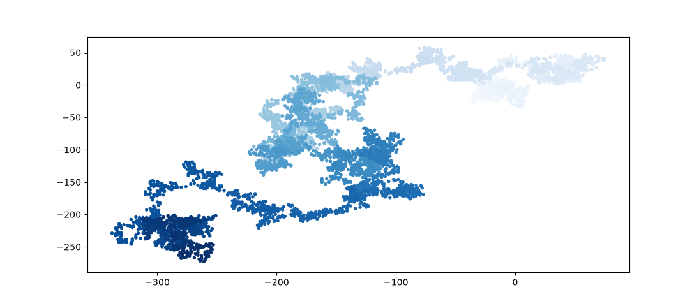
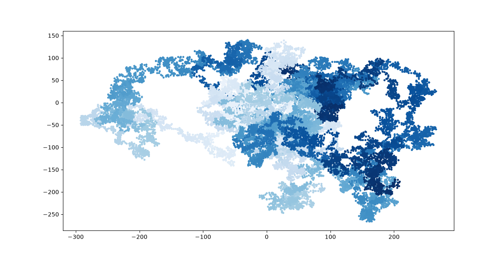

# Random Walk Simulation 

A Python project that simulates and visualizes a "random walk".

Random walks have applications in fields such as physics, biology, chemistry, and economics. One classic example is the motion of a pollen grain floating on water, which is constantly pushed around by collisions with surrounding water molecules. The resulting path can be modeled using a random walk.


## Visualizations

Here are the simulations generated by the project, showing how the complexity scales with more data points:

### Standard 5,000 Point Walk
This plot shows a single, continuous random walk tracking 5,000 individual steps.


### Five Independent 10,000-Point Walks
This plot shows five separate random walks, each consisting of 10,000 points. 


---

## How It Works

The project is built using a custom `RandomWalk` class that handles the logic of the simulation, combined with `matplotlib` to render the results visually.

1. **The Grid:** The walk starts at the origin coordinates `(0, 0)`.
2. **The Step Logic:** For each step, the program randomly determines:
   * **Direction:** Moving right or left (`1` or `-1`), up or down (`1` or `-1`).
   * **Distance:** Moving anywhere from `0` to `4` units.
   
3. **Redundancy Check:** If a step results in zero movement in both directions, it is rejected and re-rolled so the path keeps moving.


## Implementation Details

> Language: Python 3
> Visualization: Matplotlib
> Random Number Generation: Python `random` module
> Programming Paradigm: Object-Oriented Programming (OOP)

## Getting Started

### Prerequisites

You need Python installed on your machine along with the `matplotlib` library. You can install it via pip:

```bash
pip install matplotlib